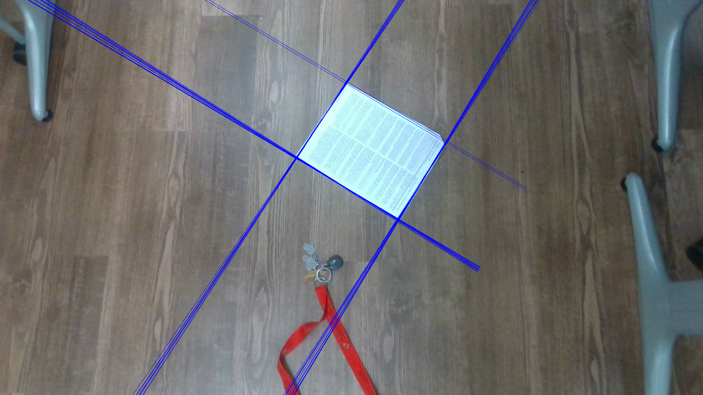
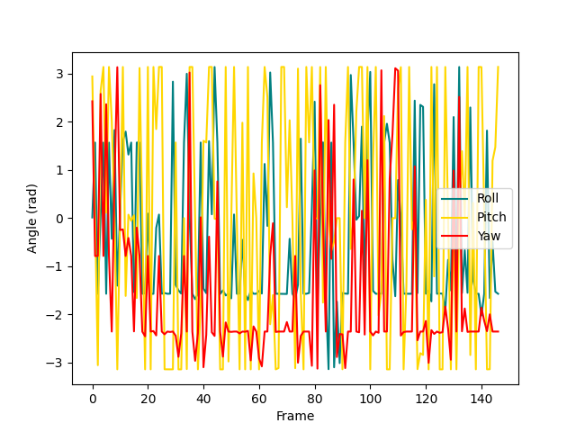
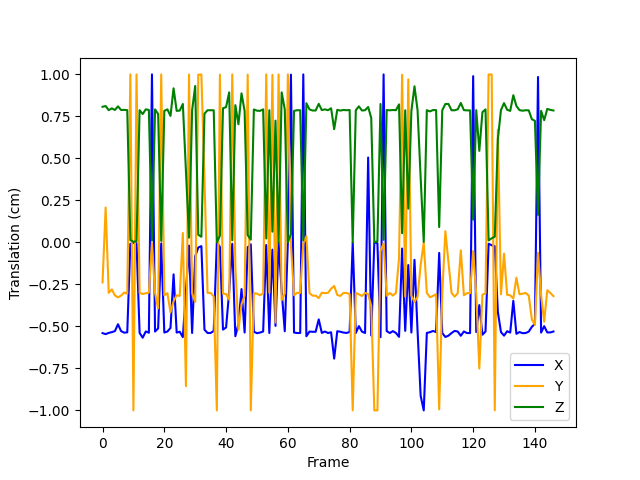
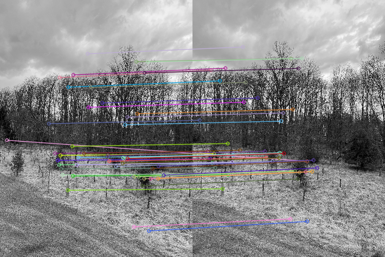
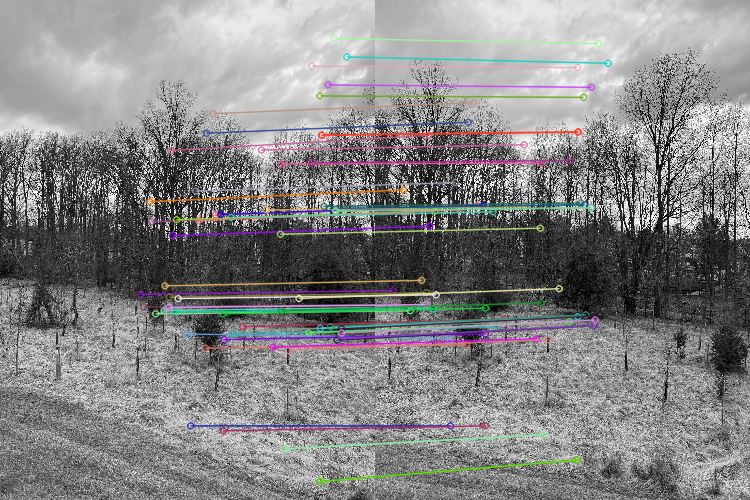
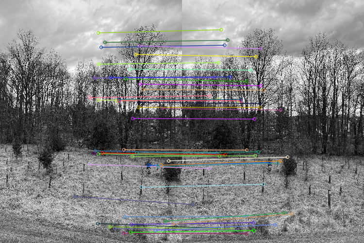
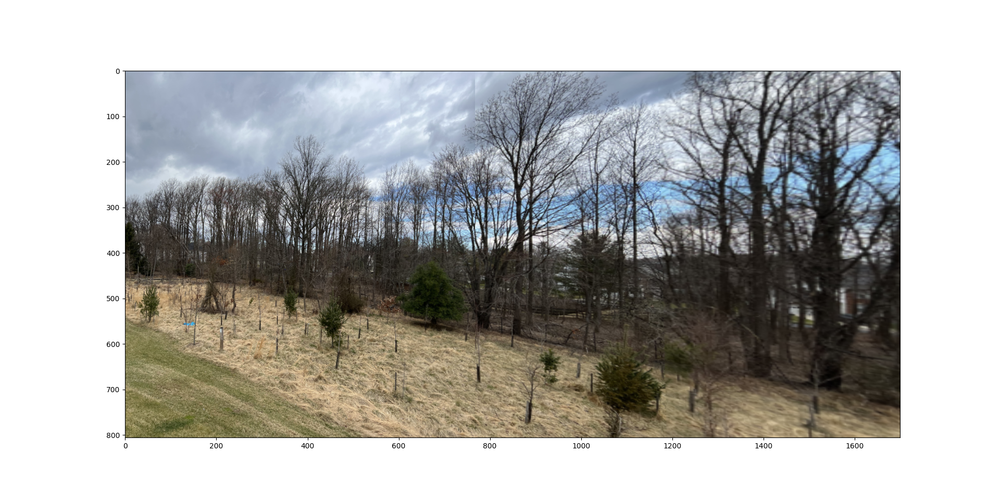

# ENPM673 - Perception for Autonomous Robots
## Camera Pose Estimation and Image Stitching

## Dependencies
python 3.11 (any version above 3 should work) Python running IDE (I used VS Code)

## Libraries
- import cv2 as cv,os
- import numpy as np
- import matplotlib.pyplot as plt,math
- import math

## Steps to run the program
1. Install all libraries necessary
2. Run .py files

## Problem 1: Camera Pose Estimation using Homography
Design an image processing pipeline to extract the paper on the ground and then extract all of its corners using the Hough Transformation technique. Once you have all the corner points, compute the homography between real-world points and pixel coordinates of the corners. Write your own function to compute homography.Decompose the obtained homography matrix to get the rotation and translation between the camera and a coordinate frame with the origin located on one corner of the sheet of paper.
Data: The dimensions of the paper are 21.6 cm x 27.9 cm. The camera's intrinsic matrix can be found in the provided link.

- **Result**:  
  - **Corners Detection**:  
   
  - **Rotation**:  
   
  - **Translation**:  
   

## Problem 2: Image Stitching for Panorama Creation
Extract features from each frame (using any feature extractor).
Match the features between each consecutive image and visualize them.
Compute the homographies between the pairs of images.
Combine these frames together using the computed homographies to create a panoramic image.

- **Result**:  
  - **Matches 1-2**:  
   
  - **Matches 2-3**:  
   
  - **Matches 3-4**:  
   
  - **Panorama**:  
   
